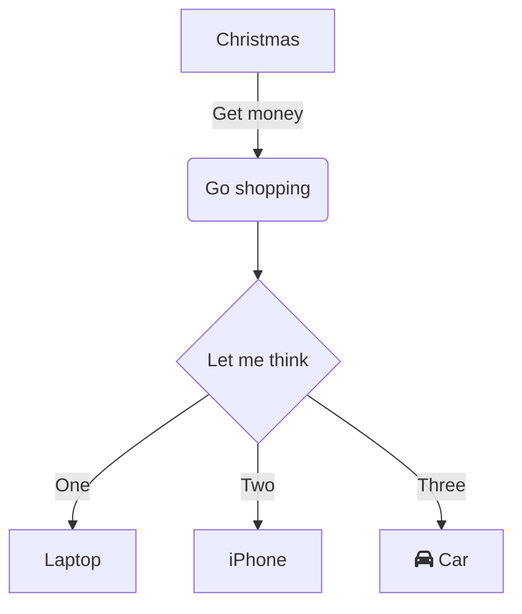

<!--MERMAID {width:100}-->

<!--MCONTENT {content: "graph TD \nA\\[Christmas\\] \\-\\-\\>|Get money| B(Go shopping) \nB \\-\\-\\> C{Let me think} \nC \\-\\-\\>|One| D\\[Laptop\\] \nC \\-\\-\\>|Two| E\\[iPhone\\] \nC \\-\\-\\>|Three| F\\[fa:fa-car Car\\] \n\n "} --->

 

 

This file was generated by Swimm. [Click here to view it in the app](/repos/Z2l0aHViJTNBJTNBRFgxMVN0YXJ0ZXIlM0ElM0FjbWc3MDYz/docs/15hkq).
